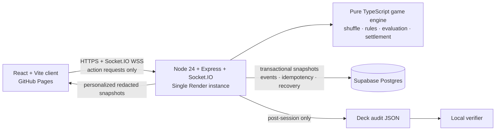

# Friendly Card Room

Friendly Card Room is a private, server-authoritative multiplayer website for No-Limit Texas Hold’em and Blackjack with a server-controlled dealer. Friends enter with a display name and six-character invite code; there is no public room directory and no permanent account requirement.

> **Play-money only — no cash value.** There are no deposits, withdrawals, payments, purchasable chips, cryptocurrency, real-world prizes, or public stranger betting pools.

The initial deployment profile is deliberately sized for relatively small private rooms among friends: one authoritative Node process, up to nine players per room, and Supabase Postgres persistence.

## Features and screens

- Landing page with separate Poker and Blackjack room flows
- Private create/join forms with optional scrypt-hashed passwords
- Lobby seats, readiness, online state, host indicator, rules, invites, and five-second auto-start
- Responsive oval Hold’em table with private hole cards, board, blinds, pot, turn, raise-to controls, all-in, and history
- Multiplayer Blackjack table with split hands, totals, wagers, insurance, surrender, outcomes, and automatic dealer
- Plain-text, rate-limited room chat separated from the authoritative game log
- Secure browser-held reconnect token, exponential backoff, and fresh personalized recovery snapshots
- Server deadlines, automatic Poker check/fold, and automatic Blackjack stand
- SHA-256 deck commitments and post-session audit export/verification
- Keyboard focus states, ARIA card/action labels, live regions, touch-sized controls, and reduced-motion/animation settings

## Architecture



The server alone creates/shuffles cards, owns turn order and deadlines, validates actions, evaluates hands, builds side pots, runs the dealer, and changes balances. A browser sends only a requested action plus `clientActionId`, room/player identity, and expected state version. Per-room queues serialize conflicts, and accepted game actions atomically append an event, snapshot, and idempotency record.

## Repository layout

```text
apps/web/                 React, Vite, Tailwind, HashRouter UI
apps/server/              Express, Socket.IO, persistence, rooms, recovery
packages/game-engine/     Pure TypeScript cards, Poker, Blackjack, audits
packages/shared/          Zod schemas, event contracts, stable error codes
supabase/migrations/      PostgreSQL schema
tests/e2e/                Multi-context Playwright tests
.github/workflows/        CI and GitHub Pages deployment
render.yaml               Single-instance Render blueprint
```

## Local setup

Requirements: Node.js 24 Active LTS, npm 11+, and optionally a Supabase/Postgres database.

```bash
npm ci
cp .env.example .env
cp apps/server/.env.example apps/server/.env
cp apps/web/.env.example apps/web/.env
npm run migrate              # requires DATABASE_URL
npm run dev
```

The web app is at `http://localhost:5173`; the API health check is `http://localhost:3001/health`. Without `DATABASE_URL`, a development/test server uses non-persistent memory storage. Production refuses to start without Postgres and non-placeholder secrets.

Root commands:

```bash
npm run dev
npm run dev:web
npm run dev:server
npm run lint
npm run typecheck
npm run test
npm run test:e2e
npm run build
npm run start
npm run migrate
```

## Environment variables

| Variable | Visibility | Purpose |
|---|---|---|
| `VITE_API_URL` | Public browser value | Render HTTPS origin, e.g. `https://friendly-card-room-server.onrender.com` |
| `PORT` | Server | Render/local listen port (default `3001`) |
| `NODE_ENV` | Server | `development`, `test`, or `production` |
| `DATABASE_URL` | Server secret | Supabase Postgres connection string |
| `CLIENT_ORIGINS` | Server | Comma-separated exact origins; no wildcard |
| `SESSION_SECRET` | Server secret | At least 32 random characters |
| `ROOM_TOKEN_PEPPER` | Server secret | At least 32 random characters for reconnect hashes |
| `ROOM_TTL_HOURS` | Server | Abandoned-room expiry period |
| `LOG_LEVEL` | Server | Pino log level |

Every `VITE_` value is downloadable by every visitor. Never place a database URL, token, password, pepper, service key, or other secret in one. Store production secrets only in Render.

## Supabase setup

1. Create a Supabase project in the region nearest the Render service.
2. In **Project Settings → Database**, locate a Postgres connection string. Prefer the documented pooled/session connection compatible with a long-running Node service.
3. Add it to Render as the server-only `DATABASE_URL`; never expose it to GitHub Pages.
4. Put the local development URL in an ignored `.env` file (not `.env.example`).
5. From the repository root, run `npm run migrate`.
6. In Supabase Table Editor or SQL Editor, confirm `rooms`, `players`, `game_snapshots`, `game_events`, `processed_actions`, `shuffle_audits`, and `schema_migrations` exist.
7. Confirm the unique constraints and indexes, including room code, room/name, room/seat, processed-action primary key, and latest-snapshot index.
8. Confirm `anon` and `authenticated` have no grants on authoritative tables. The browser must not contain a Supabase URL/key and must access state only through the backend.
9. Set `DATABASE_URL` locally and start the server; verify `GET /health`, create a room, restart the backend, and reconnect to the recovered seat.
10. Review Supabase plan backups/PITR, retention, restore access, MFA, and perform a documented restore drill before relying on recovery.

Migrations are ordered SQL files in `supabase/migrations`. The runner records each filename and applies each new migration in a transaction. Back up before schema changes.

## GitHub Pages deployment

1. Push this repository to GitHub with `main` as the release branch.
2. Open **Settings → Pages** and choose **GitHub Actions** as the source.
3. In **Settings → Environments → github-pages → Variables**, add public `VITE_API_URL` with the HTTPS Render origin (no trailing secret or credentials).
4. Run **Deploy GitHub Pages** or push to `main`. Vite infers the repository base path and the workflow uploads `apps/web/dist`.
5. Open the Pages URL and verify assets plus `#/create/poker`, `#/join`, and `#/room` routing. HashRouter avoids Pages fallback rewrites.
6. Add the exact Pages origin (for example `https://owner.github.io`, or its custom-domain origin) to Render `CLIENT_ORIGINS` and redeploy the backend.

For a custom domain, configure it in Pages, secure DNS/GitHub accounts with MFA, wait for HTTPS, and use only that exact origin in CORS. GitHub workflow variables are public configuration, not secrets.

## Render deployment

1. Create a Blueprint from the repository and allow `render.yaml`; keep `numInstances: 1`.
2. Set secret `DATABASE_URL` to the Supabase connection string.
3. Set `CLIENT_ORIGINS` to `https://owner.github.io,http://localhost:5173` (and the custom domain if used).
4. Let Render generate `SESSION_SECRET` and `ROOM_TOKEN_PEPPER`, or provide independent cryptographically random values of 32+ characters.
5. Confirm `NODE_ENV=production`, `NODE_VERSION=24`, `ROOM_TTL_HOURS`, and `LOG_LEVEL`.
6. The build runs `npm ci && npm run build`; pre-deploy runs migrations; start runs `npm start` and binds `0.0.0.0:$PORT`.
7. Verify `/health` over HTTPS, then set its origin as the Pages `VITE_API_URL`.
8. Test WSS from two devices, room recovery after a controlled restart, SIGTERM shutdown logs, and database snapshots.
9. Configure Render health alerts/log retention and an external uptime check for `/health`.
10. Roll back by selecting the last known-good deploy; restore the database only through the separately tested Supabase recovery procedure.

Do not increase Render instances. Socket affinity alone is insufficient for authoritative game locks.

## Game rules implemented

### No-Limit Texas Hold’em

Two to nine players, integer chips, equal initial stacks, random first button, rotating dealer, heads-up blind/action order, automatic blinds (including short blind all-ins), two hole cards, burns, flop/turn/river, fold/check/call/bet/raise-to/all-in, full-raise minimums, short all-ins that do not incorrectly reopen action, automatic all-in runouts, showdown, independently eligible layered side pots, ties, and clockwise odd chips. Best five of seven is selected from all 21 combinations. There is no rake or default rebuy. A session completes when one player owns the remaining tournament chips.

The server timer sends an absolute deadline. Expiry checks when legal and otherwise folds; disconnecting does not pause it.

### Blackjack

One to seven players play against a deterministic server dealer using a committed six-deck shoe by default. Internal balances use half-credit units, so 3:2 blackjack and half-bet surrender stay exact without floating point; the UI displays normal credits. The dealer stands on every 17 including soft 17. Initial naturals, dealer peek, insurance (2:1 profit), push returns, double, late surrender, up to four hands, split aces, normal-pay split 21, and sufficient-balance checks are server validated. The dealer has no bankroll limit. Zero-credit players spectate.

An actionable Blackjack hand times out to stand. A disconnect never pauses the deadline.

## Reconnection and recovery

Joining returns a 256-bit reconnect token only to that player. The browser keeps it in local storage, never in a URL. PostgreSQL stores only `SHA-256(pepper + token)`. Reconnection requires room ID, player ID, and the correct token, then restores the same seat and sends a complete player-specific snapshot, including only that player’s appropriate private Poker cards. Socket.IO retries with bounded exponential backoff. On backend startup, active snapshots are loaded and expired deadlines are resolved by the server.

Room codes are invitations, not credentials for an occupied seat. Host coordination transfers to the longest-connected eligible player after the configured grace period.

## Deck-commitment audit

Before dealing, the server commits to the canonical shuffled physical-card order using `SHA256(nonce + canonical order)` and sends only the hash. The nonce/order stay server-only while play is active. After session completion, an authenticated participant may download `/api/rooms/:roomId/audit` with `x-player-id` and `x-reconnect-token`; responses are `private, no-store`.

This is **a deck-commitment audit designed to help demonstrate that the server did not modify an already committed deck during play.** It is not described as “provably fair” and does not prove an initially unbiased server choice.

Verify downloaded JSON locally:

```bash
npm run verify:audit -- path/to/session-audit.json
```

## Security model

- Strict origin allowlist, Helmet, small request/socket buffers, Zod validation, Express and event rate limits
- Cryptographic room codes/tokens/nonces/shuffles; no `Math.random()` in cards or security
- Password scrypt hashing; peppered reconnect-token hashing; timing-safe comparisons
- Per-room queues, expected versions, session/seat checks, stable errors, and unique idempotency records
- Personalized view builders remove other hole cards, hidden dealer cards, deck/shoe order, audit nonce/order, password/token hashes, and server metadata
- Structured logs redact credential headers and never intentionally log inputs containing passwords/tokens/cards
- Browser has no database credentials or authoritative database access
- Production has no rigged-deck API, query parameter, environment switch, host card control, balance editor, or winner control

See [SECURITY.md](SECURITY.md) and [the deployment checklist](docs/DEPLOYMENT_CHECKLIST.md).

## Testing

`npm test` covers card uniqueness/commitments, every hand category and important comparisons, heads-up order, blinds, minimum/full/short raises, all-in runout, fold wins, side/split/odd pots, chip conservation, Blackjack totals/naturals/insurance/double/splits/surrender/dealer behavior/accounting, room passwords/readiness/start/idempotency/version/reconnect, HTTP security, and network-view redaction.

`npm run test:e2e` starts memory-backed local services and uses independent Chromium contexts for Poker and Blackjack room creation, joining, readiness, private cards, gameplay, settlement, refresh, and reconnect. Install once with `npx playwright install chromium`.

## Scaling and limitations

The first deployment supports one backend instance. Horizontal Socket.IO scaling will require a shared adapter, Redis or similar pub/sub, distributed room locks, shared authoritative persistence, idempotent actions, deadline ownership, and cross-instance state synchronization. A load balancer or multiple Render instances must not be enabled until that design is implemented and failure-tested.

PostgreSQL stores complete authoritative snapshots for straightforward recovery; high game volume should add snapshot compaction/retention, queue/worker ownership, connection-pool monitoring, and load tests. Chat is intentionally ephemeral. There is no permanent identity, moderation dashboard, email, payment, upload, or object storage because the product does not need them.

## Troubleshooting

- **CORS error:** add the exact scheme/host/port to comma-separated `CLIENT_ORIGINS`; do not add paths or wildcards.
- **Pages assets 404:** rerun the Pages workflow from the intended repository; Vite derives the repository base path.
- **Web still targets localhost:** set the `github-pages` environment variable `VITE_API_URL` and rebuild; it is compile-time public configuration.
- **Server refuses production start:** provide `DATABASE_URL` and non-placeholder 32+ character secrets.
- **Migration already partially exists:** restore a clean backup or reconcile through a new reviewed migration; never edit a production-applied migration.
- **Reconnect fails:** room expiry, permanent leave, storage clearing, or token mismatch intentionally prevents seat recovery. A room code alone cannot recover it.
- **Playwright browser missing:** run `npx playwright install chromium`.

## Deployment and maintenance checklist

Before release, pass lint, strict typecheck, unit/integration tests, production build, and Playwright; inspect network payloads for hidden data; migrate a staging database; verify CORS/WSS/two-device reconnect; configure logs/alerts/backups; and record the deployed commit. Follow the complete [deployment checklist](docs/DEPLOYMENT_CHECKLIST.md).

Recommended cadence: automated dependency PRs weekly, application/dependency review monthly, database backup monitoring daily, restore exercise quarterly, incident contacts semiannually, and a rollback/reconnect smoke test for every significant release.

## Future improvements

- Redis-backed Socket.IO adapter and distributed room lock/deadline service
- Snapshot retention/compaction and dedicated metrics/error tracking
- Optional blind schedules, richer session summaries, and downloadable hand histories
- Moderation controls limited to lobby/chat coordination without game-state power
- More cross-browser and assistive-technology regression coverage
